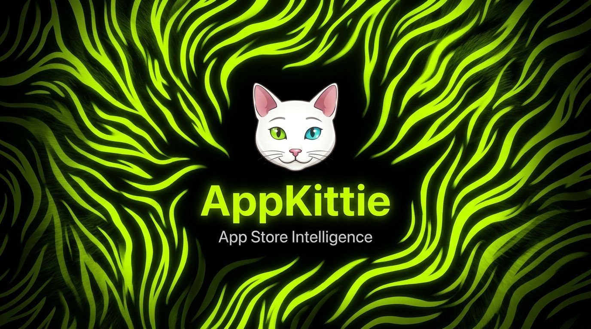

# AppKittie — mobile app intelligence for AI agents

**Full API documentation:** [www.appkittie.com/docs](https://www.appkittie.com/docs)



Turn **Cursor**, **Claude Code**, **Manus**, or any Agent Skills–compatible assistant into a research partner for the App Store and Google Play: discovery, ASO, competitors, growth, revenue, and ads—backed by live data from the [AppKittie API](https://appkittie.com) (**2M+ mobile apps**, estimates, growth windows, and ad signals).

---

## Install the skills

Today’s coding agents load **Agent Skills** from disk: each skill is a folder with a `SKILL.md` (and optional files), placed where your tool looks—commonly `.cursor/skills/`, `.claude/skills/`, `.agents/skills/`, or `.codex/skills/`. You either **copy** those folders, **subscribe** to a remote rule (Cursor), or use a **CLI** that fetches from GitHub (Claude Code).

**Claude Code** — official installer; downloads this repo and registers the skills:

```bash
npx skills add appkittie/mcp
```

Install only specific skills:

```bash
npx skills add appkittie/mcp --skill keyword-research competitor-analysis
```

If you already cloned the repo: `cp -r mcp/skills/* .claude/skills/`

**Cursor** — **Settings** (⌘⇧J) → **Rules** → **Add Rule** → **Remote Rule (GitHub)** → `https://github.com/appkittie/mcp`, *or* copy skills locally:

| Where | Command |
|-------|---------|
| Project | `cp -r mcp/skills/* .cursor/skills/` |
| User (all projects) | `cp -r mcp/skills/* ~/.cursor/skills/` |

**Manus** — **Skills** → **Create / Import** → **Import from public GitHub repository** → `https://github.com/appkittie/mcp`.

Manus expects a `SKILL.md` at the repository root, so this repo includes a root `SKILL.md` wrapper that routes to the focused workflow docs under `skills/`.

**Any other agent** — clone and point `skills/` at the path your client documents:

```bash
git clone https://github.com/appkittie/mcp.git
cp -r mcp/skills/* .cursor/skills/   # or .claude/skills/, .agents/skills/, .codex/skills/
```

---

## Install the MCP server

Skills describe *how* to reason about mobile app store work; **MCP** exposes live tools (`search_apps`, keyword endpoints, etc.) against AppKittie. Create an API key at [appkittie.com/settings/api-keys](https://appkittie.com/settings/api-keys) (it is only shown once when created).

**Claude Code** — register the hosted server (HTTP transport + bearer auth):

```bash
claude mcp add appkittie --transport http https://mcp.appkittie.com --header "Authorization: Bearer YOUR_API_KEY"
```

Substitute your real key for `YOUR_API_KEY`.

**Cursor and other MCP clients** — use the same URL and `Authorization: Bearer …` header in your app’s MCP configuration. Example JSON: [Wire up the MCP server](#wire-up-the-mcp-server) below.

---

## What you get

| Piece | Role |
|--------|------|
| **Skills** | Opinionated playbooks under `skills/`—how to ask questions, structure answers, and chain workflows |
| **MCP server** | Hosted proxy (`mcp.appkittie.com`) so MCP clients can call AppKittie without wiring HTTP yourself |
| **REST API** | Direct `GET`/`POST` to `https://appkittie.com/api/v1` for scripts, backends, or custom tools |

Skills compose: e.g. **competitor-analysis** may point you to **keyword-research**, then **metadata-optimization** for execution.

---

## Wire up the MCP server

The worker on **Cloudflare** forwards requests to AppKittie. **Claude Code** users can register via [`claude mcp add` above](#install-the-mcp-server); everyone else (e.g. **Cursor**) typically pastes config like this:

1. Create a key: [appkittie.com/settings/api-keys](https://appkittie.com/settings/api-keys) (shown once—copy immediately).
2. Register the server:

```json
{
  "mcpServers": {
    "appkittie": {
      "url": "https://mcp.appkittie.com",
      "headers": {
        "Authorization": "Bearer YOUR_API_KEY"
      }
    }
  }
}
```

### MCP tools

| Tool | Purpose | Credits |
|------|---------|---------|
| `search_apps` | Filter App Store and Google Play apps (30+ parameters) | 1 × rows returned |
| `get_app_detail` | Metadata, revenue, ads, IAPs, creators, contacts, history | 1 / call |
| `get_keyword_difficulty` | One keyword: popularity, difficulty, traffic, top apps | 10 / call |
| `batch_keyword_difficulty` | Up to 10 keywords, ranked by opportunity | 10 × keyword |
| `get_supported_countries` | Valid storefront codes | Free |

### MCP prompts

| Prompt | Use case |
|--------|----------|
| `discover_niche` | Walk through profitable niches inside a category |
| `competitor_analysis` | Structured competitive intel |
| `keyword_research` | Prioritize and document a keyword set |
| `app_growth_report` | Gainers, losers, trend read |
| `ad_intelligence` | Category or niche ad landscape |

---

## Skill catalog

### Intelligence & positioning

| Skill | Link | Summary |
|-------|------|---------|
| App discovery | [app-discovery](skills/app-discovery) | Slice the catalog by category, money, traction, ratings, ads, and more |
| Keyword research | [keyword-research](skills/keyword-research) | Popularity, difficulty, traffic score, leaders—turn into a ranked plan |
| Metadata | [metadata-optimization](skills/metadata-optimization) | Title, subtitle, keyword field, description with variants and limits |
| Competitors | [competitor-analysis](skills/competitor-analysis) | Gaps, revenue contrast, ad teardown, positioning |

### Growth, money, ads

| Skill | Link | Summary |
|-------|------|---------|
| Growth | [growth-analysis](skills/growth-analysis) | Fast movers, drivers, emerging patterns |
| Revenue | [revenue-analysis](skills/revenue-analysis) | Benchmarks, monetization, IAP shape, pricing |
| Ads | [ad-intelligence](skills/ad-intelligence) | Meta + Apple Search Ads footprint, creatives, UA angles |

### Shared context

| Skill | Link | Summary |
|-------|------|---------|
| Marketing context | [app-marketing-context](skills/app-marketing-context) | One doc: app, audience, rivals, goals—feeds the other skills |

---

## Example prompts & commands

Natural language (after skills are installed):

- “Surface the highest-earning Health & Fitness apps.”
- “US keyword set for a meditation app—prioritize by opportunity.”
- “Competitive read for app id `1234567890`.”
- “Who’s buying Meta ads in productivity lately?”
- “What’s climbing fastest this week?”
- “Rewrite title + subtitle for these keywords, three options each.”
- “Capture my marketing context so follow-ups stay consistent.”
- “Rough revenue band for education—who owns the top?”

Slash-style entry points in clients that install the focused folders directly: `/app-discovery`, `/keyword-research`, `/metadata-optimization`, `/competitor-analysis`, `/growth-analysis`, `/ad-intelligence`, `/revenue-analysis`.

In clients that import the GitHub repo as one skill, such as Manus, use `/appkittie` and describe the workflow you want.

---

## How an agent typically runs

1. Loads the relevant `SKILL.md` (templates, guardrails, output shape).
2. Calls AppKittie—via MCP tools or HTTP—e.g. `search_apps` with category + `sortBy: revenue`, or `batch_keyword_difficulty` for a seed list, then `get_keyword_difficulty` on shortlist items.
3. Synthesizes: tables, takeaways, and next actions instead of raw JSON dumps.

---

## REST API quick reference

**Base:** `https://appkittie.com/api/v1`  
**Auth:** `Authorization: Bearer <key>` — same keys as the dashboard.

```bash
curl -sS "https://appkittie.com/api/v1/apps?search=fitness&limit=5" \
  -H "Authorization: Bearer YOUR_API_KEY"
```

### Routes & billing

| Route | Verb | Role | Credits |
|-------|------|------|---------|
| `/api/v1/apps` | GET | Search / filter apps | 1 per app in the payload |
| `/api/v1/apps/:appId` | GET | Full detail for one app | 1 per request |
| `/api/v1/keywords/difficulty` | GET | Single keyword | 10 per request |
| `/api/v1/keywords/difficulty` | POST | Batch (≤10 keywords) | 10 per keyword with data |

### Payload shape

Success bodies use a top-level `data`. Lists add cursor pagination:

```json
{
  "data": [{ "title": "Calm", "score": 4.8, "downloads": 85000 }],
  "pagination": { "nextCursor": 50, "totalCount": 12450 }
}
```

Request the next page with `cursor=<nextCursor>`. `null` means end of results.

### `GET /api/v1/apps` filters (AND-combined)

| Group | Parameters |
|-------|------------|
| Text | `search` — title, developer, description |
| Categories | `categories`, `excludedCategories` (comma-separated names) |
| Store | `source`, `excludedSource` (`apple_mobile` \| `google_mobile`) |
| Metrics | `minDownloads` / `maxDownloads`, `minRevenue` / `maxRevenue`, `minRating` / `maxRating`, `minReviews` / `maxReviews`, lifetime download/revenue min/max |
| Price | `priceType` (`all` \| `free` \| `paid`), `minPrice`, `maxPrice` |
| Growth sort | `sortBy=growth`, `growthMetric=reviews`, `growthPeriod` (`7d`, `14d`, `30d`, `60d`, `90d`). Growth direction/range filters are temporarily unavailable |
| Signals | `hasMetaAds`, `hasAppleAds`, `hasCreators`, `hasEmails`, `hasWebsite` |
| Content | `contentRating`, `languages`, `developer` |
| Time | `releasedAfter`, `updatedAfter` (Unix seconds) |
| Order | `sortBy` (`growth`, `rating`, `reviews`, `updated`, `released`, `downloads`, `revenue`, `trending`, `newest`), `sortOrder` (`asc` \| `desc`) |

Full parameter matrix: [tools/REGISTRY.md](tools/REGISTRY.md).

### cURL samples

High-revenue fitness slice:

```bash
curl -sS "https://appkittie.com/api/v1/apps?search=fitness&categories=Health+%26+Fitness&minRevenue=10000&sortBy=revenue&sortOrder=desc&limit=10" \
  -H "Authorization: Bearer YOUR_API_KEY"
```

Batch keywords (US storefront):

```bash
curl -sS -X POST "https://appkittie.com/api/v1/keywords/difficulty" \
  -H "Authorization: Bearer YOUR_API_KEY" \
  -H "Content-Type: application/json" \
  -d '{"keywords":["meditation","sleep tracker","mindfulness","breathing exercises","yoga"],"country":"US","source":"apple_mobile"}'
```

### Credits & headers

- **App list:** 1 credit per returned row; if your balance is below `limit`, the API trims the page.
- **App detail:** 1 credit per call.
- **Keyword (single):** 10 credits per call.
- **Keyword (batch):** 10 credits per keyword that returns data; duplicates removed before charge.

Every response can include `X-Credits-Used` and `X-Credits-Remaining`. Balance also appears on the [API Keys](https://appkittie.com/settings/api-keys) page.

### Rate limits

Per key, **60s sliding window**. Useful headers:

| Header | Meaning |
|--------|---------|
| `X-RateLimit-Limit` | Ceiling for the window |
| `X-RateLimit-Remaining` | Calls left |
| `X-RateLimit-Reset` | Unix time when the window rolls |

`429` includes reset timing—back off or wait.

### Errors

JSON body includes `error`; validation issues add `details` per field.

| HTTP | Situation |
|------|-----------|
| 400 | Bad input — inspect `details` |
| 401 | Missing or invalid key |
| 402 | Out of credits |
| 404 | Unknown app |
| 429 | Rate limited |
| 500 | Server fault |
| 503 | Search backend unavailable |

### Fields you can expect

- **List rows:** Title, icon, developer, category, rating, reviews, review growth, download/revenue estimates (e.g. trailing 30d revenue), release/update timestamps.
- **Detail:** Everything above plus description, screenshots, versions, IAP catalog, Meta creatives (assets, copy, status, dates), Apple Search Ads by country, creator deals, contact hints, socials, hiring flags, historical series for rank/reviews/revenue/downloads.
- **Keywords:** Popularity and difficulty (0–100), competing app count, traffic score (0–100), leaderboard snippets (title, icon, reviews, score, rank).

## License

MIT
